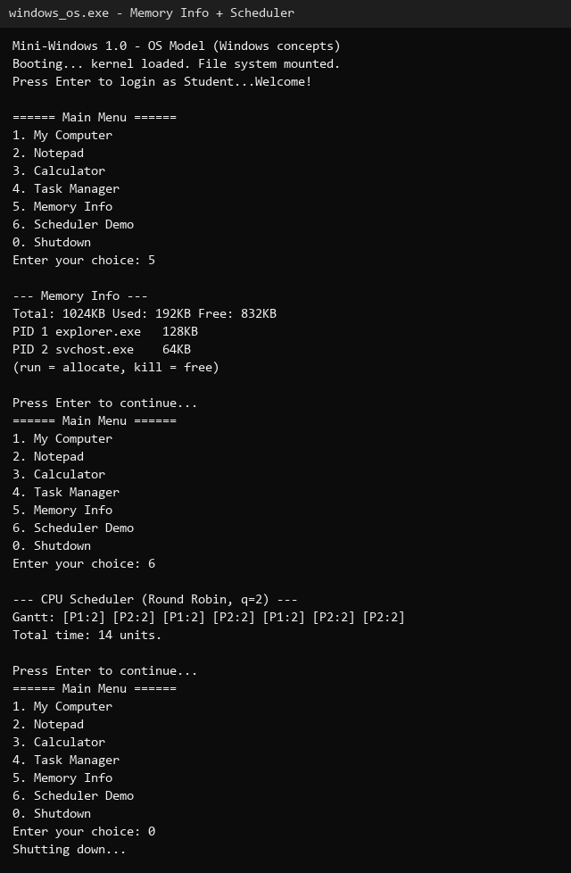
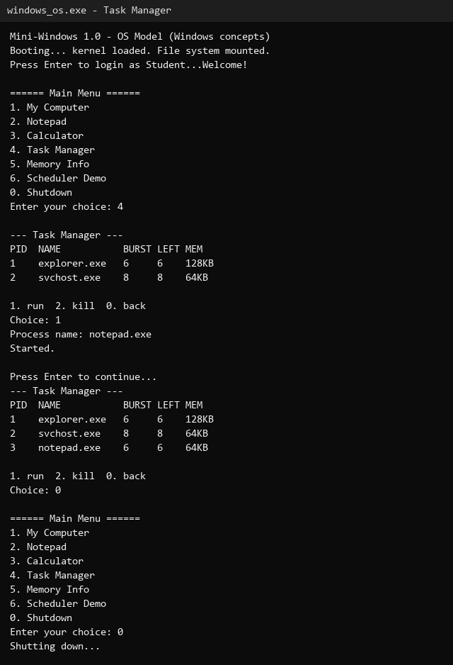
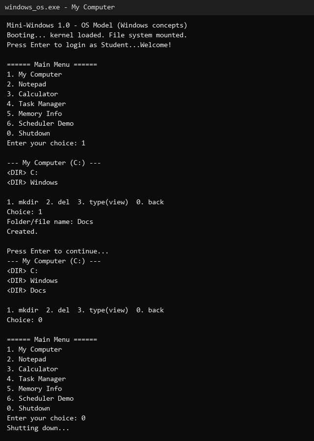

# OS Assignment Week 1

Menu-driven working model of Windows OS concepts in C (process table, Round-Robin scheduler, memory manager, virtual file system, Notepad and Calculator apps).

Compile: `gcc windows_os.c -o windows_os`

Run: `./windows_os` (Linux/Mac) or `windows_os.exe` (Windows)

## Menu

```
====== Main Menu ======
1. My Computer
2. Notepad
3. Calculator
4. Task Manager
5. Memory Info
6. Scheduler Demo
0. Shutdown
```

## Screenshots

Memory Info followed by the Scheduler Demo:



Starting a new process in Task Manager:



Creating a folder in My Computer:



## How it works

Two tables hold the whole system. `fs` is the disk (50 file slots with a name,
text content and file/folder flags). `procs` is the process table (20 slots
with pid, name, burst time, remaining time, memory and an active flag):

```c
typedef struct {
    char name[32]; char content[256];
    int isDir; int inUse;
} VFile;

typedef struct {
    int pid; char name[32];
    int burst; int remaining;
    int mem; int active;
} PCB;
```

Memory is counted, not really allocated. `usedMemory()` adds up whatever the
live processes hold out of 1024 KB, and starting a process is refused when
nothing is free:

```c
int usedMemory() {
    int s = 0, i;
    for (i = 0; i < MAX_PROCS; i++)
        if (procs[i].active) s += procs[i].mem;
    return s;
}
```

The scheduler demo runs Round-Robin with a quantum of 2: every live process
gets 2 units per turn, in table order, until all remaining times reach zero:

```c
run = procs[i].remaining < QUANTUM ? procs[i].remaining : QUANTUM;
printf("[P%d:%d] ", procs[i].pid, run);
procs[i].remaining -= run;
```

Everything lives in memory, so closing the program wipes the system and the
next start boots fresh.
